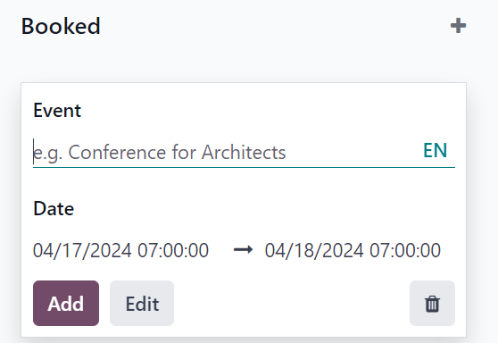

:nosearch:

======
Events
======

.. seealso::
   - `Odoo Tutorials: Events <https://www.odoo.com/slides/surveys-63>`_

The Odoo *Events* application allows users to create, manage, and analyze events of any kind, with
a complete suite of planning, communication, and reporting tools.

Odoo *Events* is fully-integrated with other Odoo applications, which provides users with the
ability to publish events on their website, sell tickets (online or via sales orders), and grant
access to attendees, via barcodes or QR codes. Odoo *Events* also allows users to send automated
messages and social posts leading up to *and* after the event.

Users can generate and gather valuable data about their events, and their attendees, which they can
use to improve their overall decision-making and event-planning in the future.

Events dashboard
================

When the *Events* application is opened, Odoo reveals the main :guilabel:`Events` dashboard, which
can be viewed in a number of different ways. Those different view options are accessible from the
:guilabel:`Events` dashboard in the upper-right corner, via a series of view-related icon buttons.

By default, the :guilabel:`Events` dashboard is displayed in the :icon:`oi-view-kanban`
:guilabel:`Kanban` view, which is populated with a variety of pipeline stages.

This view showcases all the events in the database in their respective stages. By default, the
stages are: :guilabel:`New`, :guilabel:`Booked`, :guilabel:`Announced`, :guilabel:`Ended`, and
:guilabel:`Cancelled`.

.. note::
   The :guilabel:`Ended` and :guilabel:`Cancelled` stages are folded, by default, and located to the
   right of the other stages.

On each event card, users can find the scheduled date of the event, the name of the event, the
location, the number of expected :guilabel:`Attendees`, any scheduled activities related to the
event, the status of the event, and the person responsible for the event.

To quickly add a new event to a pipeline, click the :guilabel:`➕ (plus)` icon at the top of the
stage to which the event should be added to reveal a blank Kanban card to fill out.

In this blank Kanban card, enter the name of :guilabel:`Event`, along with the start and end
:guilabel:`Date` and time.

Then, either click :guilabel:`Add` to add it to the stage and edit it later, or click
:guilabel:`Edit` to add the event to stage and edit its configurations on a separate page.

Each event card can be dragged-and-dropped into any stage on the Kanban pipeline, providing easy
organizational access.

.. toctree::

   events/create_events
   events/sell_tickets
   events/track_manage_talks
